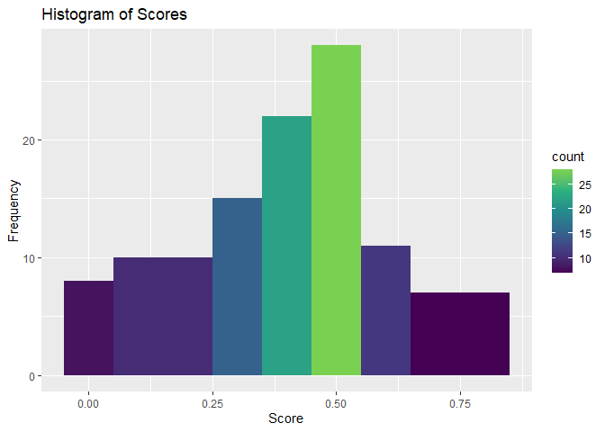

“oal” - Occasional Active Learning
================
Andre Abadi
2024-09-03

## Introduction

The aim of the **oal** project (**This Project**) is to implement active
learning for eDiscovery using the R programming language, exclusively
for learning purposes. This initiative focuses on developing a system to
efficiently process the Enron dataset, a collection comprising extensive
email communications relevant to the infamous collapse of Enron.

## Import

We load a specific subset of the Enron e-discovery dataset, focusing
only on the doc_id, relevant, and content columns. The dataset is then
converted to a tibble format and filtered to remove any rows where the
relevant value is NA. Finally, an excerpt of the content from a specific
document is displayed, wrapped to a width of 75 characters for
readability.

    ## Please review the attachment and let me know if you have any changes.
    ## The final document will provide a starting place for the year end review
    ## process.

## Clean

We perform extensive preprocessing on the content column of the Enron
dataset. We apply various Regex patterns to remove non-word characters,
URLs, email addresses, and file paths. The content is then converted to
lower case, contractions are expanded, and Unicode normalization is
applied. We remove stop words and clean up whitespace to ensure no extra
spaces remain. Finally, we filter out rows with empty content after
preprocessing. We display the cleaned content of a specific document as
an excerpt.

    ## review attachment final document provide starting review process

## Message Length Survey

We visualize the distribution of message lengths in the Enron dataset.
Each message’s length is calculated, and the distribution is plotted on
a logarithmic scale to better handle the wide range of message lengths.
The histogram is color-coded using the viridis color palette, enhancing
the visualization by mapping the frequency of message lengths to a
gradient. The plot provides insights into how the lengths of messages
are distributed across the dataset.

## Truncate

We truncate the messages as part of development to improve our ability
iterate training-evaluation cycles and understand hyperparameter
turning. We envisage removing this pre-processing step at some stage
once accuracy is at competitive levels.

    ## review attachment final document provide starting review process

## Training/Testing Split

We split the classified data into training and testing subsets at an
80:20 ratio. This means that the model can train on 80% of the available
data while 20% is held out and not seen by the model during training, so
that it can be used to evaluate model performance fairly. We show ratio
of relevant and not-relevant documents in each set as a means of
checking that undertaking this process yielded sets that were balanced
across the binary classification.

    ## # A tibble: 2 × 3
    ##   relevant     n percentage
    ##      <int> <int>      <dbl>
    ## 1        0   659       50.2
    ## 2        1   655       49.8

    ## # A tibble: 2 × 3
    ##   relevant     n percentage
    ##      <int> <int>      <dbl>
    ## 1        0   176       52.2
    ## 2        1   161       47.8

## Tokenize

We tokenize the training set by creating a vocabulary of all words used
therein, in frequency order i.e. lower vocabulary indexes indicate
higher frequency of the word in the data. We provide the same sample
message again in tokenized form, to show the effect of this step, which
makes the messages readable by the model.

    ## [[1]]
    ##     review attachment      final   document    provide   starting     review 
    ##         50       1350        259        110        103       1117         50 
    ##    process 
    ##        117

## Convert to Tensors

Mainly procedural, we must convert these plain lists into a format known
as Tensors, which is a data storage format designed specifically for
machine learning and the torch framework. The same message is shown
again, with only the vocabulary word indexes in the order they appear in
the message. Duplicates are allowed, and this effectively completes the
conversion of the message from human readable format to machine-learning
friendly format.

    ## torch_tensor
    ##    50
    ##  1350
    ##   259
    ##   110
    ##   103
    ##  1117
    ##    50
    ##   117
    ## [ CPULongType{8} ]

## Train and Evaluate Model

With the data preprocessed and converted into the necessary formats, we
can train a neural network on the training data and then evaluate it on
the unseen test data. We have several parameters and hyperparameters
available when undertaking this process, and we list them below with a
short description.

- `embedding_dim`: Determines the size of the word embeddings, where
  each word in the vocabulary is mapped to a vector of this length.
  - Higher dimensions capture more nuances but increase computational
    cost.
- `n_hidden`: Sets the number of hidden units in the neural network’s
  hidden layer(s).
  - This controls the model’s capacity to learn complex patterns.
- `batch_size`: Specifies the number of samples processed before the
  model’s internal parameters are updated.
  - Larger batch sizes provide a more stable gradient estimate but
    require more memory.
- `learn_rate`: Controls how much the model’s parameters are adjusted
  with respect to the loss gradient.
  - A smaller learning rate can lead to more precise convergence but
    slower training.
- `num_epochs`: Defines how many times the entire training dataset
  passes through the model.
  - More epochs allow the model to learn better but increase the risk of
    overfitting if too many epochs are used.

With the parameters and hyperparameters loaded, the model trains
accordingly. The losses are rendered below at each *epoch*. We then
switch the model to evaluation mode, pass the test data to the model and
evaluate how effectively the model classifies the unseen test data.

    ## Epoch: 1 Average Loss: 3.879612 
    ## Epoch: 2 Average Loss: 26.06334 
    ## Epoch: 3 Average Loss: 26.76064 
    ## Epoch: 4 Average Loss: 20.05321 
    ## Epoch: 5 Average Loss: 14.95605 
    ## Epoch: 6 Average Loss: 10.79899

    ## [1] 0.6016949

## Result Distribution

We provide a histogram showing distribution of test scores. We expect an
effect model to have higher frequencies at extremes.

## Result Sample

We also provide a sample of scores on the test dataset below. These are
merely illustrative and not indicative of model performance.

    ##                doc_id relevant       score
    ## 1  ENR.0001.0045.0984        1 0.301126719
    ## 2  ENR.0001.0217.0701        1 0.304157943
    ## 3  ENR.0001.0037.0631        1 0.224877238
    ## 4  ENR.0001.0177.0856        1 0.741389453
    ## 5  ENR.0001.0118.0483        1 0.001948948
    ## 6  ENR.0001.0117.0087        0 0.446642727
    ## 7  ENR.0001.0113.0742        0 0.237299293
    ## 8  ENR.0001.0118.0421        0 0.384884804
    ## 9  ENR.0001.0117.0243        0 0.484267861
    ## 10 ENR.0001.0115.0166        0 0.423004180

## Bayesian Hyperparameter Optimisation

    ## elapsed = 3.02   Round = 1   embedding_dim = 57.0000 n_hidden = 118.0000 batch_size = 285.0000   learn_rate = 0.005027222    num_epochs = 9.0000 Value = 0.6271186 
    ## elapsed = 1.24   Round = 2   embedding_dim = 68.0000 n_hidden = 123.0000 batch_size = 259.0000   learn_rate = 0.007204423    num_epochs = 3.0000 Value = 0.4237288 
    ## elapsed = 2.25   Round = 3   embedding_dim = 87.0000 n_hidden = 95.0000  batch_size = 718.0000   learn_rate = 0.00991987 num_epochs = 7.0000 Value = 0.5000 
    ## elapsed = 0.94   Round = 4   embedding_dim = 119.0000    n_hidden = 92.0000  batch_size = 446.0000   learn_rate = 0.003862348    num_epochs = 2.0000 Value = 0.5508475 
    ## elapsed = 0.64   Round = 5   embedding_dim = 51.0000 n_hidden = 38.0000  batch_size = 793.0000   learn_rate = 0.007796708    num_epochs = 3.0000 Value = 0.4915254 
    ## elapsed = 2.35   Round = 6   embedding_dim = 123.0000    n_hidden = 49.0000  batch_size = 618.0000   learn_rate = 0.005021856    num_epochs = 7.0000 Value = 0.5677966 
    ## elapsed = 3.95   Round = 7   embedding_dim = 107.0000    n_hidden = 128.0000 batch_size = 721.0000   learn_rate = 0.005376449    num_epochs = 10.0000    Value = 0.4661017 
    ## elapsed = 2.51   Round = 8   embedding_dim = 92.0000 n_hidden = 44.0000  batch_size = 538.0000   learn_rate = 0.003652285    num_epochs = 9.0000 Value = 0.5254237 
    ## elapsed = 1.74   Round = 9   embedding_dim = 95.0000 n_hidden = 59.0000  batch_size = 904.0000   learn_rate = 0.004034705    num_epochs = 6.0000 Value = 0.4830508 
    ## elapsed = 2.34   Round = 10  embedding_dim = 58.0000 n_hidden = 35.0000  batch_size = 546.0000   learn_rate = 0.004706346    num_epochs = 10.0000    Value = 0.3983051 
    ## elapsed = 2.95   Round = 11  embedding_dim = 79.0000 n_hidden = 118.0000 batch_size = 869.0000   learn_rate = 0.003836681    num_epochs = 9.0000 Value = 0.5254237 
    ## elapsed = 1.15   Round = 12  embedding_dim = 94.0000 n_hidden = 32.0000  batch_size = 426.0000   learn_rate = 0.006755333    num_epochs = 4.0000 Value = 0.5338983 
    ## elapsed = 1.14   Round = 13  embedding_dim = 94.0000 n_hidden = 32.0000  batch_size = 426.0000   learn_rate = 0.006755333    num_epochs = 4.0000 Value = 0.5338983 
    ## elapsed = 1.13   Round = 14  embedding_dim = 94.0000 n_hidden = 32.0000  batch_size = 426.0000   learn_rate = 0.006755333    num_epochs = 4.0000 Value = 0.5338983 
    ## elapsed = 1.13   Round = 15  embedding_dim = 94.0000 n_hidden = 32.0000  batch_size = 426.0000   learn_rate = 0.006755333    num_epochs = 4.0000 Value = 0.5338983 
    ## 
    ##  Best Parameters Found: 
    ## Round = 1    embedding_dim = 57.0000 n_hidden = 118.0000 batch_size = 285.0000   learn_rate = 0.005027222    num_epochs = 9.0000 Value = 0.6271186

    ## embedding_dim      n_hidden    batch_size    learn_rate    num_epochs 
    ##  5.700000e+01  1.180000e+02  2.850000e+02  5.027222e-03  9.000000e+00
