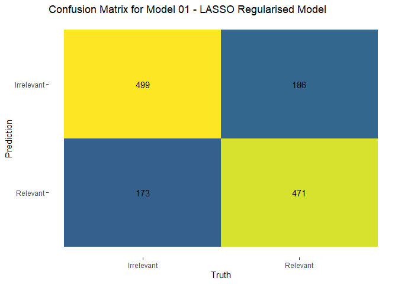

“oal” - Occasional Active Learning
================
Andre Abadi
2024-11-01

## Introduction

The aim of this project is to develop a predictive model for binary
classification of legal documents. Many e-discovery platforms implement
such predictive models but are proprietary. This project aims to provide
an open source equivalent, not for production (necessarily) but for
educational purposes. We hope to meet or exceed the following metrics:

| .metric  | estimate |
|----------|----------|
| accuracy | 0.74     |
| roc_auc  | 0.77     |

### References

Our primary text reference for this project is *Supervised Machine
Learning for Text Analysis in R* (**SMLTAR**) by Emil Whitfield and
Julia Silge. This text is available as an interactive resource at
[smltar.com](https://smltar.com/).

### Style and Conventions

- Code is written using `snake_case` and attempts to follow the guidance
  of the online resource [*R for Data Science
  (2e)*](https://r4ds.hadley.nz/) by Wickham, Çetinkaya-Rundel, and
  Grolemund.
- We also adopt the [*Tidyverse Style
  Guide*](https://style.tidyverse.org/) with a preference toward piping
  operations where possible for code clarity.
- We use the native pipe where possible and fall back to the
  [*magrittr*](https://magrittr.tidyverse.org/) pipe where necessary.
- We also use the
  [*viridis*](https://cran.r-project.org/web/packages/viridis/vignettes/intro-to-viridis.html),
  colourising charts to improve accessibility of visualisations for
  readers with colour vision deficiency.
- We use [Tidymodels](https://www.tidymodels.org/) for our analysis, as
  it promotes good modelling practices by streamlining workflows,
  minimizing data leakage risks, and ensuring reproducibility.

## Import

    ## Rows: 5,000
    ## Columns: 8
    ## $ doc_id     <chr> "ENR.9000.0001.0040", "ENR.9000.0001.0133", "ENR.9000.0001.…
    ## $ relevant   <fct> NA, NA, NA, NA, 1, 0, NA, NA, NA, NA, NA, NA, NA, NA, NA, 0…
    ## $ date       <dttm> 2001-05-02 19:36:00, 2000-07-17 10:46:00, 2000-02-15 12:53…
    ## $ from       <chr> "phillip.allen@enron.com'", "phillip.allen@enron.com'", "ph…
    ## $ to         <chr> "james.steffes@enron.com'", "paul.lucci@enron.com'", "hunte…
    ## $ subject    <chr> NA, "Comments on Order 637 Compliance Filings", "Storage of…
    ## $ train_test <fct> NA, NA, NA, NA, train, test, NA, NA, NA, NA, NA, NA, NA, NA…
    ## $ content    <chr> "Jim, Is there going to be a conference call or some type o…

## Prepare

### Tidy

    ## Rows: 1,662
    ## Columns: 4
    ## $ doc_id     <chr> "ENR.9000.0001.0380", "ENR.9000.0001.0382", "ENR.9000.0002.…
    ## $ relevant   <fct> 1, 0, 0, 0, 0, 0, 0, 1, 1, 1, 0, 0, 0, 0, 0, 1, 1, 0, 0, 0,…
    ## $ train_test <fct> train, test, train, train, test, train, train, train, test,…
    ## $ content    <chr> "I also need to know the base salaries of Jay Reitmeyer and…

### Splits and Folds

### Preprocessing Recipes

Our first recipe is a basic recipe for ingestion to the null model, and
is unfiltered tokenization truncated at the top 1000 with TF-IDF
subsequently applied. We do not propose to use it for any true
modelling.

The second recipe is similar to the first, with unfiltered tokenization,
but this time with the top *n* tokens set for tuning between 500 and
5000, and TF-IDF applied subsequently as with the previous recipe.

## Modelling

### Model 00 - Null Model

[SMLTAR 7.2](https://smltar.com/mlclassification#classnull)

> “a ‘null model’ or baseline model, \[is\] a simple, non-informative
> model that always predicts the largest class for classification. Such
> a model is perhaps the simplest heuristic or rule-based alternative
> that we can consider as we assess our modelling efforts.”

| .metric  |      mean |   std_err |
|:---------|----------:|----------:|
| accuracy | 0.4883402 | 0.0121034 |
| roc_auc  | 0.5000000 | 0.0000000 |

The null model above shows a ROC_AUC indicating that without any
predictive modelling, the null model guesses the correct classification
that proportion of the time. This is consistent with the 50:50 breakdown
of labelled training data. It is akin to flipping a coin, and provides
our baseline that we hope to improve upon.

### Model 01 - Naive Bayes

[SMLTAR 7.1.1](https://smltar.com/mlclassification#classfirstmodel)

A Naive Bayes classifier applies Bayes’ Theorem to predict class
membership by calculating conditional probabilities, making the “naive”
assumption that features are conditionally independent of each other.
Despite this simplifying assumption, the classifier is remarkably
effective, particularly for text classification tasks. It works by
learning the probability of each feature occurring within each class
during training, then combining these probabilities with prior class
probabilities to predict the most likely class for new instances.

| .metric  |      mean |   std_err |
|:---------|----------:|----------:|
| accuracy | 0.7088346 | 0.0101899 |
| roc_auc  | 0.7375180 | 0.0078804 |

Analysing the above results we see that there is reasonable but
unbalanced performance. The model was effective at classifying the
irrelevant documents but did not perform well at classifying the
relevant documents. Given the balanced training data, this suggests the
model did not perform well at this task.

### Model 02 - LASSO

[SMLTAR 7.3](https://smltar.com/mlclassification#comparetolasso)

> “Regularized linear models are a class of statistical model that can
> be used in regression and classification tasks. Linear models are not
> considered cutting edge in NLP research, but are a workhorse in
> real-world practice. Here we will use a lasso regularized model
> (Tibshirani 1996), where the regularization method also performs
> variable selection. In text analysis, we typically have many tokens,
> which are the features in our machine learning problem.”

| .metric  |      mean |   std_err |
|:---------|----------:|----------:|
| accuracy | 0.7298644 | 0.0110272 |
| roc_auc  | 0.8038973 | 0.0135815 |

In the above results we see that the LASSO model produces more balanced
classifications between Relevant and Irrelevant. The regularisation
penalty was tuned to achieve the above result. We see a small increase
in the accuracy metric, and a significant improvement in the ROC_AUC
metric. This, combined with the subjective assessment via the confusion
matrix suggests an improved model overall.

